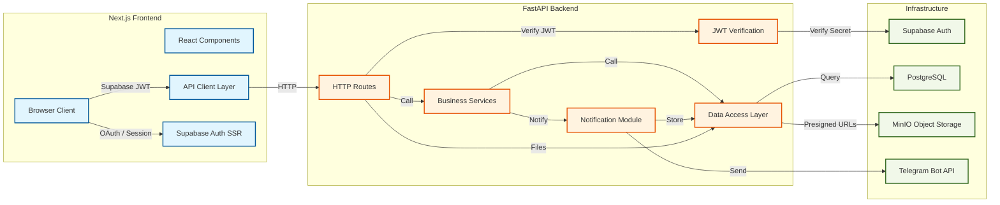
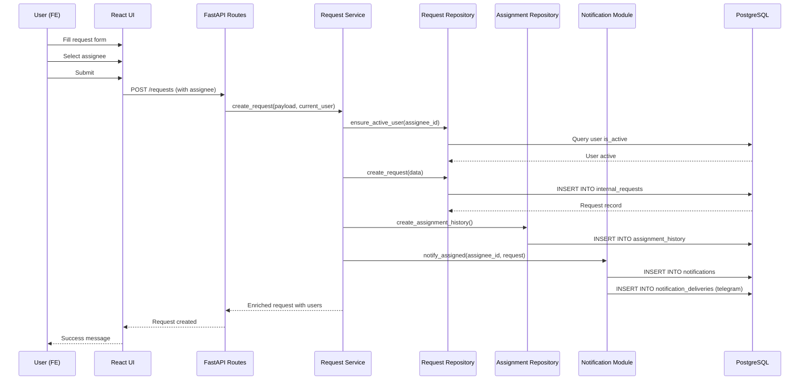
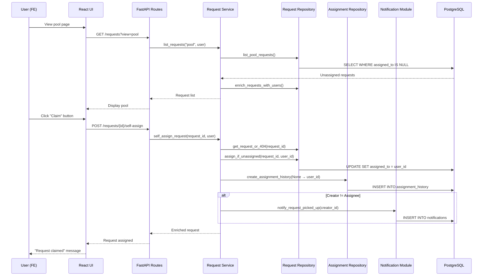
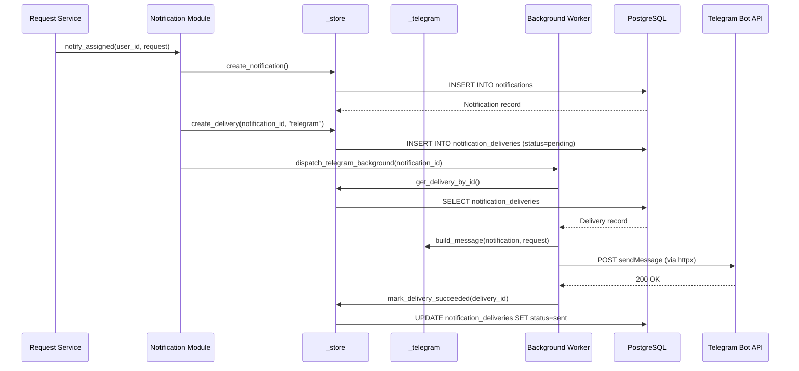
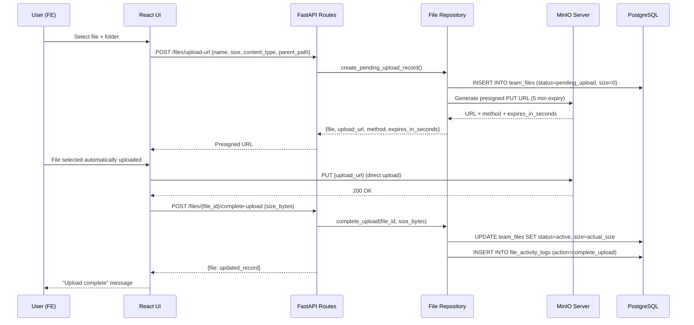
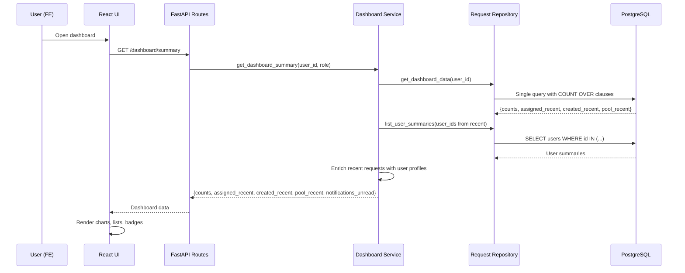
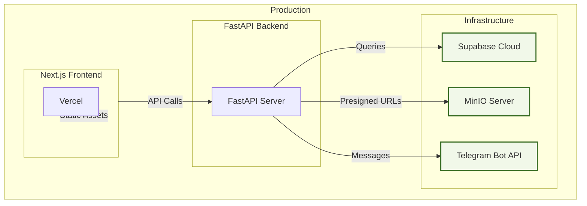

# Team Request Hub - Architecture Overview

Generated from codebase analysis using GitNexus knowledge graph.

## Overview

Team Request Hub is a **two-app monorepo** consisting of:

- **`apps/web`** - Next.js 15 frontend (React 19, TypeScript, Tailwind CSS v4, shadcn/ui)
- **`apps/api`** - FastAPI backend (Python, Supabase PostgreSQL, MinIO object storage)

The system enables teams to create, assign, and track development requests with real-time notifications via web UI and Telegram bot integration.

## Runtime Architecture



## Functional Areas

### 1. Authentication & Authorization

**Frontend:**
- `apps/web/src/app/(auth)/login/page.tsx` - Google OAuth login
- `apps/web/src/app/auth/callback/route.ts` - OAuth callback handler
- `apps/web/src/app/auth/welcome/page.tsx` - Post-login gate checking `is_active`
- `apps/web/src/lib/supabase/middleware.ts` - Session refresh middleware

**Backend:**
- `apps/api/app/core/auth.py` - JWT verification, user profile loading
- `apps/api/app/core/permissions.py` - Role-based access control (fe/be/lead)
- `apps/api/app/routes/users.py` - User management endpoints

**Flow:**
1. User clicks Google OAuth → Supabase Auth → Access token
2. Frontend stores token → Backend verifies JWT via secret
3. Backend loads user profile from `public.users`
4. Welcome gate checks `is_active` → Allow/deny dashboard access

### 2. Request Management

**Frontend:**
- `apps/web/src/app/(dashboard)/requests/page.tsx` - Request list (multiple views)
- `apps/web/src/app/(dashboard)/requests/[requestId]/page.tsx` - Request detail
- `apps/web/src/app/(dashboard)/requests/new/page.tsx` - Create request form
- `apps/web/src/app/(dashboard)/assigned/page.tsx` - Assigned requests
- `apps/web/src/app/(dashboard)/pool/page.tsx` - Pool of unassigned requests
- `apps/web/src/app/(dashboard)/done/page.tsx` - Done requests

**Backend:**
- `apps/api/app/routes/requests.py` - Request CRUD endpoints
- `apps/api/app/services/request_service.py` - Request workflow orchestration
- `apps/api/app/repositories/request_repository.py` - Request data access
- `apps/api/app/repositories/assignment_repository.py` - Assignment audit trail
- `apps/api/app/repositories/status_log_repository.py` - Status change audit trail

**Request States:** `pending → acknowledged → in_progress → done` (can cancel at any stage)

### 3. Dashboard & Statistics

**Frontend:**
- `apps/web/src/app/(dashboard)/dashboard/page.tsx` - Main dashboard
- `apps/web/src/components/app/app-shell.tsx` - App layout shell

**Backend:**
- `apps/api/app/routes/dashboard.py` - Dashboard summary endpoint
- `apps/api/app/services/dashboard.py` - Dashboard aggregation logic
- `apps/api/app/repositories/request_repository.py` - Statistics queries

**Metrics:** assigned count, created count, pool count, done count, urgent count, recent requests

### 4. Notification System

**Frontend:**
- `apps/web/src/app/(dashboard)/notifications/page.tsx` - Notifications list
- `apps/web/src/components/notifications/notification-list.tsx` - Notification display
- `apps/web/src/lib/api/notifications.ts` - Notification API client

**Backend:**
- `apps/api/app/notification_module/__init__.py` - Notification orchestration (deep module)
- `apps/api/app/notification_module/_store.py` - Notification records and delivery tracking
- `apps/api/app/notification_module/_telegram.py` - Telegram message formatting
- `apps/api/app/notification_module/_webhook.py` - Telegram webhook handler
- `apps/api/app/routes/notifications.py` - Notification endpoints
- `apps/api/app/routes/telegram.py` - Telegram linking/webhook endpoints

**Notification Types:** assigned, reassigned, status_changed, pool_new, replied, done, cancelled

**Delivery Channels:** In-app (database), Telegram (async webhook)

### 5. Team Files Explorer

**Frontend:**
- `apps/web/src/app/(dashboard)/files/page.tsx` - Files explorer
- `apps/web/src/components/files/team-file-explorer.tsx` - File browser component

**Backend:**
- `apps/api/app/routes/files.py` - File management endpoints
- `apps/api/app/repositories/file_repository.py` - File metadata access
- `apps/api/app/repositories/file_activity_repository.py` - File operation audit trail

**Features:**
- Directory hierarchy navigation
- Search by filename
- Upload/download (presigned MinIO URLs)
- Preview (images, PDF)
- Soft-delete with 7-day trash retention
- Lead-only: rename, move, batch-copy, delete, restore, purge

### 6. User Administration

**Frontend:**
- `apps/web/src/app/(dashboard)/admin/users/page.tsx` - User management UI
- `apps/web/src/components/admin/user-role-table.tsx` - Role assignment table

**Backend:**
- `apps/api/app/routes/users.py` - User CRUD and role management
- `apps/api/app/services/users.py` - User business logic
- `apps/api/app/repositories/user_repository.py` - User data access

**Roles:** `fe` (frontend), `be` (backend), `lead` (admin)

## Key Execution Flows

### Flow 1: Create Request with Assignment



**Steps:**
1. Frontend validates form → Calls `POST /requests`
2. Route handler → `request_service.create_request()`
3. Service validates assignee is active via `user_repository.ensure_active_user()`
4. Service creates request in `internal_requests` table
5. Service creates assignment history record
6. Service triggers notification (in-app + telegram)
7. Notification stored in `notifications` and `notification_deliveries` tables
8. Telegram delivery dispatched asynchronously (background worker)
9. Response enriched with creator/assignee profiles

### Flow 2: Self-Assign from Pool



**Steps:**
1. Fetch pool: Filter `assigned_to IS NULL` + status not done/cancelled
2. Permission check: User can view request via `ensure_can_view_request()`
3. Optimistic assignment: `assign_if_unassigned()` uses `UPDATE ... WHERE assigned_to IS NULL`
4. Create assignment history: `from_user_id=None, to_user_id=current_user`
5. Notify creator (only if different user) that request was picked up
6. Return enriched request

### Flow 3: Telegram Notification Delivery



**Steps:**
1. Service calls `notify_assigned()` → creates notification record
2. Creates delivery record with status `pending`
3. Dispatches to background worker (async function)
4. Worker fetches delivery, builds formatted message via `_telegram`
5. Sends to Telegram API using bot token
6. Marks delivery as `sent` or `failed`

**Message Formatting:** Bilingual (EN/VI) based on user's `preferred_language`

### Flow 4: File Upload (Two-Step Presigned URL)



**Why Two-Step?**
- Offloads upload bandwidth to MinIO directly (frontend → MinIO)
- Backend only stores metadata and generates URLs
- Large files don't go through FastAPI backend
- Limits: 200MB max file size, 5-minute presigned URL expiry

### Flow 5: Dashboard Statistics Aggregation



**Optimization:**
- Single PostgreSQL query using window functions (`COUNT OVER`) for all counts
- No N+1 queries for recent requests
- User summaries batched via `IN` clause
- Response bounded to current user's role and permissions

## Data Layer Architecture

### Backend Layering

```
HTTP Routes (app/routes/)
    ↓ Validates request/response schemas
    ↓ FastAPI dependency injection (auth, permissions)
    ↓

Services (app/services/)
    ↓ Business logic orchestration
    ↓ Permission checks (is_lead, ensure_can_view_request)
    ↓ Side effects (notifications, audit logs)
    ↓

Repositories (app/repositories/)
    ↓ Supabase table access
    ↓ Query building (filters, sorts, limits)
    ↓ Data transformations
    ↓

Supabase PostgreSQL (app/db/supabase.py)
    ↓ Service-role client
    ↓ RLS policies (defense-in-depth)
    ↓

Database Schema
```

### Notification Module (Deep Module)

```
notification_module/
    __init__.py (Public API)
        notify_assigned()
        notify_reassigned()
        notify_status_changed()
        notify_done()
        notify_cancelled()
        dispatch_telegram_delivery()

    _store.py (Internal: DB access)
        create_notification()
        create_delivery()
        mark_delivery_succeeded()
        mark_delivery_failed()

    _telegram.py (Internal: Message formatting)
        build_assignment_message()
        build_status_changed_message()
        build_done_message()

    _webhook.py (Internal: Telegram webhook)
        handle_webhook()
        parse_start_command()
        link_user_account()
```

**Why deep module?**
- Public API hides internal adapters (`_store`, `_telegram`, `_webhook`)
- Caller doesn't need to know about DB schema or Telegram API
- Easy to add new channels (email, Slack) without touching call sites

### Frontend Data Flow

```
React Components
    ↓ useQuery / useMutation (TanStack Query)
    ↓

API Client (apps/web/src/lib/api/)
    ↓ Fetch with Bearer JWT
    ↓ Type-safe request/response
    ↓

FastAPI Backend
    ↓ Routes → Services → Repositories
    ↓

Supabase PostgreSQL
```

**State Management:**
- TanStack Query v5 for server state (caching, refetching, optimistic updates)
- React Context for auth state (current_user)
- URL params for filters (view=assigned|created|pool|done)
- No global state management library (Redux/Zustand) - TanStack Query sufficient

## Security Model

### Authentication Flow

1. **Supabase Auth** handles OAuth (Google), passwordless, email
2. Frontend receives Supabase access token
3. Frontend includes token in `Authorization: Bearer <token>` header
4. Backend verifies JWT signature using `SUPABASE_JWT_SECRET`
5. Backend loads user profile from `public.users` table
6. Backend returns user to routes via `Depends(get_current_user)`

### Authorization

**Roles:**
- `fe` - Frontend team: create, self-assign, update own requests, cancel own requests
- `be` - Backend team: same as `fe`
- `lead` - Admin: view all requests, reassign any, cancel any, update user roles

**Enforcement:**
- `app/core/permissions.py` - Permission functions (`ensure_can_view_request`, `ensure_can_reassign`, etc.)
- Routes use `Depends(get_current_user)` to verify auth
- Services check roles before mutating operations
- Frontend disables buttons for better UX (but backend is source of truth)

**Row Level Security (RLS):**
- Enabled on all `public.*` tables as defense-in-depth
- Frontend never queries directly (only via backend)
- Backend uses service-role key for full access
- RLS policies narrow direct authenticated access (e.g., user can read own profile)

## Technology Stack

### Frontend (`apps/web`)

- **Framework:** Next.js 15 App Router
- **UI:** React 19 + TypeScript (strict mode)
- **Styling:** Tailwind CSS v4
- **Components:** shadcn/ui (Slate base color)
- **State:** TanStack Query v5
- **Auth:** Supabase Auth + SSR (`@supabase/ssr`)
- **Forms:** React Hook Form + Zod
- **Icons:** Lucide React

### Backend (`apps/api`)

- **Framework:** FastAPI
- **Runtime:** Python 3.x (uv package manager)
- **Database:** Supabase PostgreSQL
- **Object Storage:** MinIO (self-hosted S3-compatible)
- **Notifications:** Telegram Bot API (async delivery)
- **Testing:** unittest (Python standard library)
- **Config:** pydantic-settings (environment variables)

## Performance Optimizations

### Backend

1. **PostgreSQL composite indexes** on `internal_requests` (assignee + created_at, status + created_at)
2. **Single dashboard query** using window functions (`COUNT OVER`)
3. **Batch user enrichment** via `IN` clause instead of N+1
4. **Presigned URLs** for MinIO (direct upload/download, bypass backend)
5. **Partial indexes** on `notification_deliveries` (status=pending) for worker polling
6. **Request timing logging** via `LOG_REQUEST_TIMING=true` (local dev)

### Frontend

1. **TanStack Query caching** - refetch on window focus, cache stale-after 5 min
2. **Route-based code splitting** - Next.js App Router automatic
3. **Image optimization** - Next.js `<Image>` component (in future)
4. **Debounced search** - File explorer search input

## Deployment Architecture



**Frontend:** Deployed to Vercel (edge caching, automatic HTTPS)

**Backend:** Deployed to container platform (Docker + uvicorn)

**Infrastructure:**
- Supabase Cloud (PostgreSQL + Auth)
- MinIO (self-hosted or S3-compatible)
- Telegram Bot API (free tier)

## Monitoring & Observability

### Backend

- **Request timing:** `LOG_REQUEST_TIMING=true` logs query duration
- **Error handling:** Custom exceptions (`NotFoundError`, `BadRequestError`)
- **HTTP status codes:** FastAPI standard (200, 403, 404, 500)
- **Future:** OpenTelemetry, structured logging, metrics

### Frontend

- **Error boundaries:** React error boundaries (in future)
- **Network errors:** TanStack Query retry logic
- **Console logging:** Dev-only console.error
- **Future:** Sentry, performance monitoring

## Future Enhancements

### Planned Features

1. **Email notifications** - Add email channel to notification module
2. **File versioning** - Track file versions and restore history
3. **Request templates** - Reusable request templates
4. **Scheduling** - Schedule requests for future delivery
5. **Integrations** - GitHub, Slack, Jira webhooks

### Architectural Improvements

1. **Deepening users service** - Add audit trails, notifications for role changes
2. **Event sourcing** - Store domain events for replay/audit
3. **Message queue** - Replace async Telegram delivery with proper queue
4. **API versioning** - `/v1/` routes for backward compatibility
5. **GraphQL** - Alternative to REST for complex queries

---

*Generated: 2025-05-25*
*Codebase: Team Request Hub (2479 symbols, 4131 relationships, 143 execution flows)*