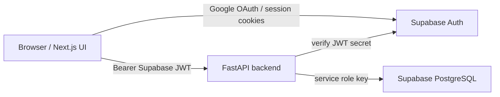

# Architecture

Team Request Hub is a two-app repository:

```txt
apps/web  Next.js frontend
apps/api  FastAPI backend
```

There is no root workspace runner. Run each app from its own directory.

## Runtime Boundaries



Frontend Supabase usage is limited to auth/session handling. Business logic,
service-role access, request workflow changes, role checks, notifications,
assignment history, and status logs belong in the backend.

## Backend Layers

The backend uses a modular service architecture:

```txt
routes -> services -> repositories -> Supabase
```

```txt
apps/api/app/
  routes/          HTTP request/response layer
  services/        business workflow and permission orchestration
  repositories/    Supabase table access
  core/            auth, config, permission helpers
  schemas/         Pydantic request/response models
  db/              Supabase client creation
  utils/           shared utilities
```

Rules:

- Routes should not contain business workflows.
- Services should own permission checks, status transitions, and side effects.
- Repositories should not contain product permissions or workflow decisions.
- Backend tests live under `apps/api/tests` and run with `uv`.

## Auth And Roles

Login/signup is owned by Supabase Auth. The frontend receives a Supabase access
token and sends it to FastAPI as a Bearer token.

FastAPI verifies the JWT in `app/core/auth.py`, then loads the application
profile from `public.users`. The backend never trusts a role supplied by the
frontend.

New Supabase Auth users are inserted into `public.users` by the database trigger
in `DB_SCHEMA_TEAM_REQUEST_HUB.sql`. New users default to role `fe`.

Role updates are backend-only:

```txt
PATCH /users/{user_id}/role
```

Only users whose current DB profile role is `lead` can update roles.

## Request Workflow

The core request workflow lives in `app/services/request_service.py`.

Request actions update `internal_requests` and create the required side effects:

- `assignment_history` for create-with-assignee, self-assign, and reassign
- `request_status_logs` for status changes, done, cancel, and active reassign reset
- `notifications` for assignment, reassignment, status change, done, and cancel events

## Current State

- Google OAuth login/logout is implemented in `apps/web`.
- Frontend protected pages call FastAPI through `apiFetch` with a Supabase Bearer JWT.
- Request list, create, detail, workflow action, role management, and notification UI are implemented.
- Backend request workflow creates assignment history, status logs, and notifications.
- Lead role management is available through `PATCH /users/{user_id}/role`.

## Local Backend Commands

Run from `apps/api`:

```bash
uv --cache-dir .uv-cache venv
uv --cache-dir .uv-cache pip install -r requirements.txt
uv --cache-dir .uv-cache run python -m unittest discover tests
uv --cache-dir .uv-cache run uvicorn app.main:app --reload --port 8000
```

Backend request timing can be enabled locally with `LOG_REQUEST_TIMING=true`. Use it when diagnosing slow API endpoints before adding optimizations.
