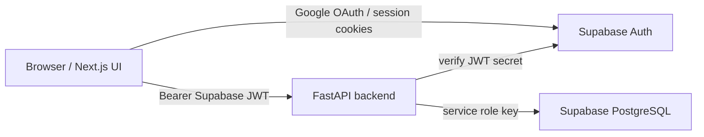

# Architecture

Team Request Hub is a two-app repository:

```txt
apps/web  Next.js frontend
apps/api  FastAPI backend
```

There is no root workspace runner. Run each app from its own directory.

## Runtime Boundaries



Frontend Supabase usage is limited to auth/session handling. Business logic,
service-role access, request workflow changes, role checks, notifications,
assignment history, and status logs belong in the backend.

## Backend Layers

The backend uses a modular service architecture:

```txt
routes -> services / notification_module -> repositories -> Supabase
```

```txt
apps/api/app/
  routes/              HTTP request/response layer
  services/            business workflow and permission orchestration
  notification_module/ notification + Telegram channel (deep module)
  repositories/        Supabase table access
  core/                auth, config, permission helpers
  schemas/             Pydantic request/response models
  db/                  Supabase client creation
  utils/               shared utilities
```

Rules:

- Routes should not contain business workflows.
- Services should own permission checks, status transitions, and side effects.
- Repositories should not contain product permissions or workflow decisions.
- `notification_module` owns notification records, channel preferences, Telegram delivery, Email delivery, Web Push delivery, and webhook handling. Its internal adapters (`_store`, `_telegram`, `_email`, `_web_push`, `_webhook`) are not part of the public API.
- Backend tests live under `apps/api/tests` and run with `uv`.

## Auth And Roles

Login/signup is owned by Supabase Auth. The frontend receives a Supabase access
token and sends it to FastAPI as a Bearer token.

Frontend post-login flow:

```txt
/login -> /auth/callback -> /auth/welcome?next=...
```

`/auth/welcome` is an intentional gate, not a cosmetic-only page:

- It resolves runtime account state via `GET /users/me`.
- If `is_active = true`, it preloads the target page (usually dashboard) and
  then redirects.
- If `is_active = false`, it renders `ACCOUNT DISABLED` and must not redirect
  into protected dashboard routes.

FastAPI verifies the JWT in `app/core/auth.py`, then loads the application
profile from `public.users`. The backend never trusts a role supplied by the
frontend.

New Supabase Auth users are inserted into `public.users` by the database trigger
in `DB_SCHEMA_TEAM_REQUEST_HUB.sql`. New users default to role `fe`.

Role updates are backend-only:

```txt
PATCH /users/{user_id}/role
```

Only users whose current DB profile role is `lead` can update roles.

## Request Workflow

The core request workflow is orchestrated by `app/services/request_service.py` and supported by focused internal modules:

- `request_assignment_read_model.py` owns compatibility between `request_assignees`, enriched `assignees`, `assignee_ids`, and legacy `assigned_to`.
- `request_list_read_model.py` owns request list view selection.
- `request_transition_engine.py` owns status transitions, closed/open checks, and lifecycle timestamp payloads.
- `request_assignment_engine.py` owns add/remove assignee guards.
- `request_read_model_builder.py` owns creator/assignee enrichment.

Request actions update `internal_requests` and create the required side effects:

- `assignment_history` for create-with-assignee, self-assign, and reassign
- `request_status_logs` for status changes, done, cancel, and active reassign reset
- `notifications` for assignment, reassignment, status change, done, and cancel events

## File Service

File operations use MinIO (S3-compatible) for object storage with a two-step presigned URL upload flow. File metadata lives in `public.team_files` and `public.file_activity_logs`. The service module `app/services/file_service.py` orchestrates file workflows, while `app/services/file_tree.py` owns path normalization, name validation, descendant-prefix safety, and folder self-move prevention. Soft-delete uses 7-day purge scheduling. `app/services/minio_storage.py` handles all MinIO interactions.

## Current State

- Google OAuth login/logout is implemented in `apps/web`.
- Frontend protected pages call FastAPI through `apiFetch` with a Supabase Bearer JWT.
- Request list, create, detail, workflow action, role management, notification UI, and request timeline are implemented.
- Backend request workflow creates assignment history, status logs, and notifications.
- Lead role management is available through `PATCH /users/{user_id}/role`.
- Lead user approval/rejection is available through `PATCH /users/{user_id}/active`.
- Dashboard summary endpoint provides bounded workload data per active user.
- Telegram integration supports account linking, message delivery, and webhook handling.
- Notification delivery supports Telegram, Email, and Web Push for assignment and reassignment events, with per-user channel preferences.
- Team file explorer supports browse, search, upload, download, preview, rename, move, copy, batch operations, soft-delete, restore, and purge.
- Bilingual i18n (VI/EN) is implemented in the frontend with `src/i18n/config.ts`.
- User language preference is stored in `preferred_language` column and synced via `PATCH /users/me/language`.

## Local Backend Commands

Run from `apps/api`:

```bash
uv --cache-dir .uv-cache venv
uv --cache-dir .uv-cache pip install -r requirements.txt
uv --cache-dir .uv-cache run python -m unittest discover tests
uv --cache-dir .uv-cache run uvicorn app.main:app --reload --port 8000
```

Backend request timing can be enabled locally with `LOG_REQUEST_TIMING=true`. Use it when diagnosing slow API endpoints before adding optimizations.
